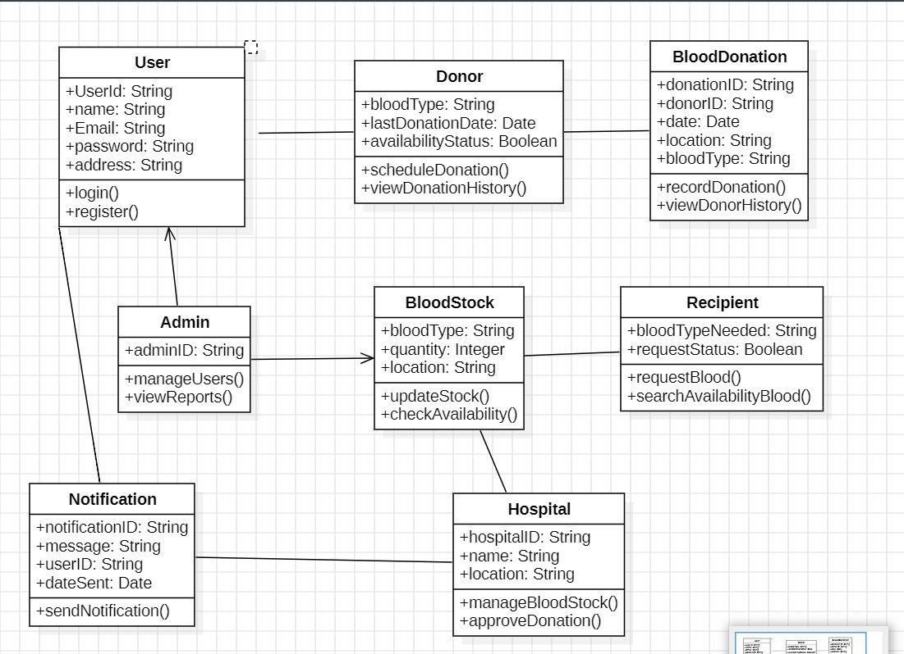

# Vital Vessels — Blood Bank Management System

Full-stack blood bank platform built in PHP and MySQL. Handles the complete workflow: donor registration, blood inventory management, hospital requests, and transfusion matching. Built as a software engineering project at VIT Chennai.

## System Overview

Three separate user portals, each with independent authentication and a distinct feature set:

- **Donor Portal** — register, manage blood group, submit donation availability, track donation history
- **Hospital Portal** — register, search available donors by blood group, manage inventory, submit transfusion requests
- **Receiver Portal** — register, request specific blood group, track request status, receive updates

All three connect to a shared `bloodbank` MySQL database handling inventory state, request workflows, and messaging.

## Key Features

- Blood group tracking across all 8 types (A+, A−, B+, B−, AB+, AB−, O+, O−)
- Request approval and rejection workflow with status updates
- Donor-hospital matching by blood group and availability
- Messaging between users and admin
- Admin panel for inventory management and statistics

## File Structure

**Root Pages**

| File | Purpose |
|---|---|
| `index.php` | Landing page |
| `login.php` | Unified login gateway |
| `register.php` | New user registration |
| `main.php` | Dashboard after login |
| `about.php` | About page |
| `bloodinfo.php` | Blood type information |
| `blooddinfo.php` | Donor blood info |
| `blooddonate.php` | Donation registration page |
| `bloodrequest.php` | Request submission page |
| `contact.php` | Contact page |
| `abs.php` | Admin blood statistics |
| `hprofile.php` | Hospital profile management |
| `rprofile.php` | Receiver/donor profile management |
| `message.php` | Messaging system |
| `logout.php` | Session termination |

**Backend Handlers (`file/`)**

| File | Purpose |
|---|---|
| `connection.php` | MySQL database connection |
| `hospitalLogin.php` / `hospitalReg.php` | Hospital authentication |
| `receiverLogin.php` / `receiverReg.php` | Receiver/donor authentication |
| `request.php` / `requestd.php` | Blood request creation |
| `accept.php` / `acceptd.php` | Accept request (receiver and donor sides) |
| `reject.php` / `rejectd.php` | Reject request |
| `cancel.php` / `canceld.php` | Cancel request |
| `delete.php` / `deleted.php` | Delete request |
| `infoAdd.php` / `infoAddd.php` | Add blood inventory info |
| `updateprofile.php` | Profile update handler |

**Other**

| File | Purpose |
|---|---|
| `sql/bloodbank.sql` | Full database schema |
| `css/style.css`, `css/styles.css` | Stylesheets |
| `script.js` | Frontend JavaScript |
| `Blood_class_diagram.jpg` | UML class diagram |
| `software.pdf` | Technical design report |
| `software (1).pptx` | Project presentation |

## Stack

PHP · MySQL · HTML · CSS · JavaScript
